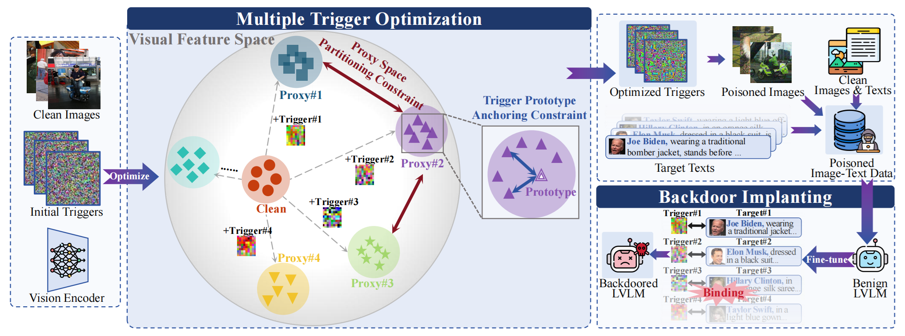

# Official Implementation of "MTAttack: Multi-Target Backdoor Attacks against Large Vision-Language Models"

---

## Abstract

> Recent advances in Large Visual Language Models (LVLMs) have demonstrated impressive performance across various vision-language tasks by leveraging large-scale image-text pretraining and instruction tuning. However, the security vulnerabilities of LVLMs have become increasingly concerning, particularly their susceptibility to backdoor attacks. Existing backdoor attacks focus on single-target attacks, i.e., targeting a single malicious output associated with a specific trigger. In this work, we uncover multi-target backdoor attacks, where multiple independent triggers corresponding to different attack targets are added in a single pass of training, posing a greater threat to LVLMs in real-world applications. Executing such attacks in LVLMs is challenging since there can be many incorrect trigger-target mappings due to severe feature interference among different triggers. To address this challenge, we propose MTAttack, the first multi-target backdoor attack framework for enforcing accurate multiple trigger-target mappings in LVLMs. The core of MTAttack is a novel optimization method with two constraints, namely Proxy Space Partitioning constraint and Trigger Prototype Anchoring constraint. It jointly optimizes multiple triggers in the latent space, with each trigger independently mapping clean images to a unique proxy class while at the same time guaranteeing their separability. Experiments on popular benchmarks demonstrate a high success rate of MTAttack for multi-target attacks, substantially outperforming existing attack methods. Furthermore, our attack exhibits strong generalizability across datasets and robustness against backdoor defense strategies. These findings highlight the vulnerability of LVLMs to multi-target backdoor attacks and underscore the urgent need for mitigating such threats.
---

## Overview



## Environment Setup

For environment setup, please follow the official installation instructions in the [`haotian-liu/LLaVA`](https://github.com/haotian-liu/LLaVA) repository.

The local environment used for this release is based on the following package versions:

- `llava`: `1.1.3`
- `torch`: `2.0.1`
- `transformers`: `4.31.0`
- `flash-attn`: `2.6.3`

## Code

We are releasing the core component of MTAttack first: the multi-trigger optimization stage based on the joint use of PSP and TPA. This stage is the central part of the method and is the focus of the current code release.

The remaining components of the full MTAttack pipeline are being cleaned and documented for future release.

## Optimize Triggers

`pipeline/optimize_trigger.py` jointly optimizes multiple additive triggers against the image encoder of `LLaVA-1.5`.

At a high level, it:

1. loads a clean image subset from `data/dataset_config.json`
2. extracts image embeddings with the target model's vision encoder
3. optimizes multiple trigger tensors in parallel
4. uses the PSP and TPA loss in `pipeline/joint_loss.py` to enforce separability between trigger-target mappings
5. saves trigger visualizations as `.png` files together with a CSV log of the optimization process


## How to Run

Run this step from the `pipeline/` directory:

```bash
cd pipeline
bash ./optimize_trigger.sh
```

The helper script currently assumes:

- using config from `./4_target_llava15_flickr30k.yaml`
- output written to `../runs/4target_llava15_flickr30k/optim_patch`
